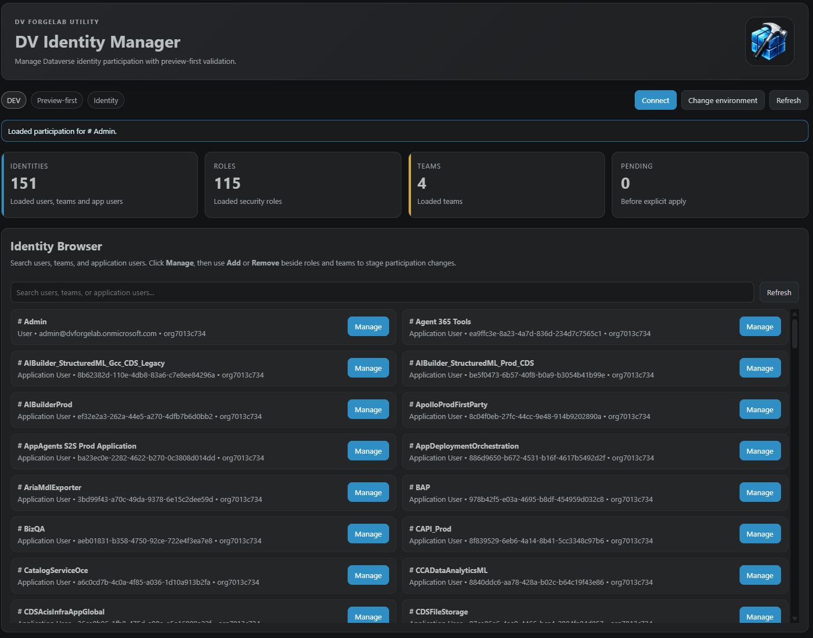
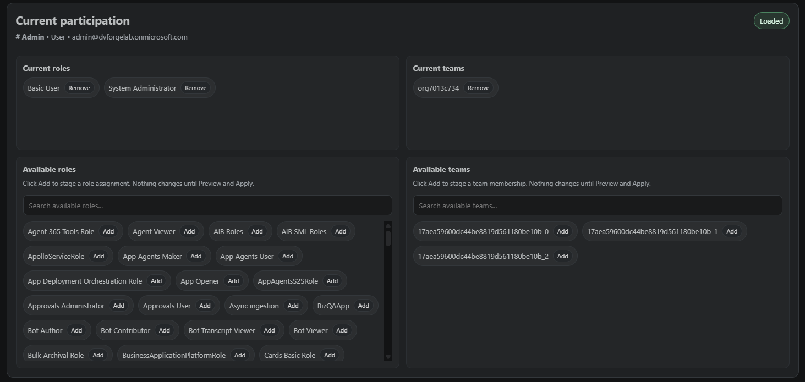
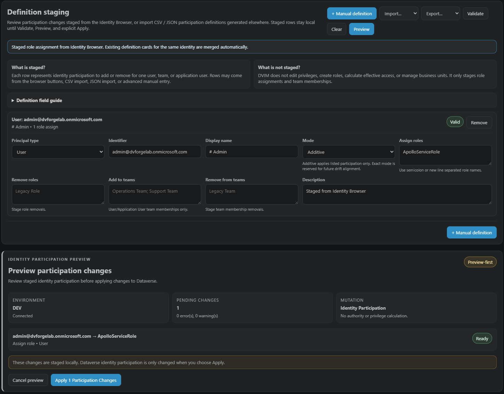

# DV Identity Manager

Manage Dataverse identity participation inside VS Code.

Version 1.0.1

**DV Identity Manager** is a focused DV ForgeLab utility for searching Dataverse identities, reviewing participation, staging assignment/membership changes, previewing them, and applying them deliberately.

It is intentionally about **participation**, not authority.

DV Identity Manager manages assignments and memberships. It does not edit privileges, calculate effective access, simulate RBAC, or determine security authority.

Changes are staged locally, validated, previewed, and only applied when explicitly confirmed.

## Highlights

- Identity Browser for users, teams, and application users
- Current participation view for roles and team memberships
- Browser-driven staging for assign/remove operations
- Definition staging workspace
- CSV import and export
- JSON import and export
- Automatic definition merge and deduplication
- Preview-first validation workflow
- Environment-aware safety indicators
- Explicit apply semantics
- Execution reporting and outcome tracking
- Shared DV ForgeLab Dataverse environment settings

## Screenshots

### Identity Browser

Search users, teams, and application users, then open participation management with a single click.



### Participation Management

Review current participation, stage role assignments and team membership changes, and prepare preview-first updates.



### Preview and Execution Reporting

Validate staged participation, preview Dataverse mutations, apply explicitly, and review execution outcomes.



## Preview-first workflow

```text
Connect
↓
Search identity
↓
Manage participation
↓
Stage changes locally
↓
Validate
↓
Preview
↓
Apply participation changes
↓
Review execution report
```

## Supported Participation Types

- User → Role assignments
- User → Team memberships
- Team → Role assignments
- Application User → Role assignments
- Application User → Team memberships

## Boundary

DV Identity Manager is intentionally a participation manager, not a security analysis tool.

It does not:

- Create roles
- Edit role privileges
- Display privilege matrices
- Calculate effective permissions
- Simulate RBAC
- Move business units
- Manage business unit hierarchy
- Perform security diagnostics
- Recommend access changes

## Shared DV ForgeLab environment settings

```json
"dvForgeLab.environments": [
  {
    "name": "DEV",
    "url": "https://org.crm6.dynamics.com",
    "tenantId": "optional-tenant-id"
  }
]
```

## Command

```text
DV Identity Manager: Open Identity Manager
```

## Philosophy

DV Identity Manager follows the DV ForgeLab preview-first invariant.

Identity participation changes are staged locally, validated, previewed, and explicitly applied by the user. Dataverse identity participation is never changed without an explicit preview and confirmation step.

## Validation & Platform Awareness

DVIM validates participation definitions before preview and apply.

Validation surfaces:

- Missing identifiers
- Unsupported participation combinations
- Managed application-user warnings
- Access-team role assignment restrictions
- Definition import diagnostics
- Duplicate and merged participation definitions

DVIM does not bypass Dataverse protections. Platform-level restrictions are surfaced during execution reporting.

## Future Direction

Future DV Quick Run comparison providers may generate `.dvim.json` identity definition artifacts from observed identity participation drift.

DV Quick Run remains responsible for investigation.

DV Identity Manager remains responsible for preview-first participation administration.

## Built By

Built by **DV ForgeLab**.

**DV Quick Run** remains the flagship Dataverse investigation workbench.

VS Code Marketplace:

https://marketplace.visualstudio.com/items?itemName=dv-forgelab.dv-quick-run
